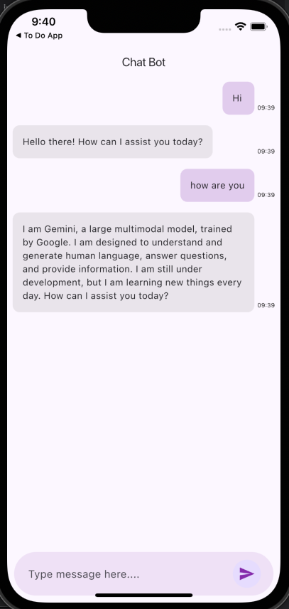

# Chat Bot Project

A Flutter-based chatbot using Google Generative AI for practice purposes.

---

## Features

- **Interactive Chatbot**: Built with Google Generative AI for engaging conversations.
- **Clean Architecture**: Separated into `Controller`, `Model`, and `View` layers.
- **Reusable Components**: Designed to be extensible and maintainable.

---

## Project Structure

The chatbot-related files are organized in the `lib/chat` directory:

```
lib/
├── chat/
│   ├── controller/
│   │   └── chat_controller.dart   # Manages chatbot logic and state.
│   ├── model/
│   │   └── message.dart           # Data model for chat messages.
│   ├── view/
│       ├── chat_view.dart         # UI for the chatbot.
```

### Directory Details

- **Controller**: Contains `chat_controller.dart`, which handles the chatbot's logic and interactions with the model and view.
- **Model**: Contains `message.dart`, which defines the structure of the chat messages (e.g., sender, content, timestamp).
- **View**: Contains `chat_view.dart`, which builds the user interface for the chatbot, displaying messages and handling user input.


---

## Installation

To run the chatbot project:

1. Clone the repository:
   ```bash
   git clone https://github.com/parasbhanot938/chat_bot.git
   ```
2. Navigate to the project directory:
   ```bash
   cd chat_bot
   ```
3. Get the required dependencies:
   ```bash
   flutter pub get
   ```
4. Run the project:
   ```bash
   flutter run
   ```

---

## Dependencies

The chatbot uses the following dependencies:

- [Google Generative AI](https://pub.dev/packages/google_generative_ai): For conversational capabilities.
- [GetX](https://pub.dev/packages/get): For state management.
- [Intl](https://pub.dev/packages/intl): For internationalization.
- [HTTP](https://pub.dev/packages/http): For API communication.

For the full list, refer to the `pubspec.yaml` file.

---

## How to Use

1. Launch the app on a connected emulator or device.
2. Interact with the chatbot through the provided UI in the `chat_view.dart`.

---

## Disclaimer

This project is for personal learning purposes and is not intended for distribution.

---
